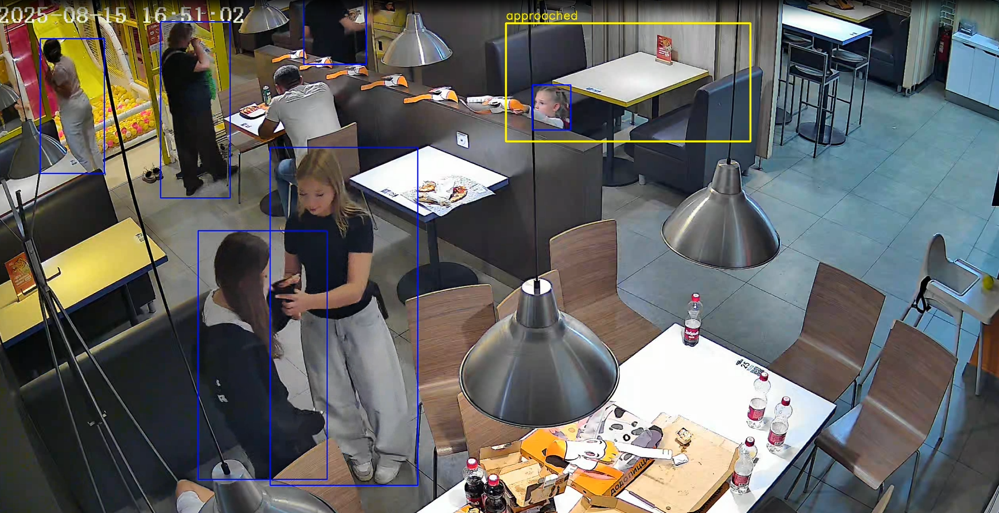

# Отслеживание статуса стола

## Запуск

### 1. Установка зависимостей

```
pip install -r requirements.txt
```

### 2. Запуск

```
python main.py --video path/to/video.mp4
```

После запуска:

* появится окно для выбора столика (ROI), после выбора жмем Enter
* начнётся обработка видео и откроется окно
* результат сохранится в output.mp4

---

## Выбранные данные

Так как все видео довольно короткие, за такой период не получается серьезно отслеживать цикл (свободно → занято), так как столы занимаются на большее время. Поэтому был сделан упор на цикл (свободно → человек подошел к столу).

После просмотра всех трех видео, было выбрано первое, так как там больше всего перемещения людей, и легкая модель спокойно определяет их почти идеально. ROI был выбран по столу, который находится в верхней части кадра, так как там чаще всего проходят люди, и один раз он становится занят до конца видео.

На втором видео легко определить людей, но движения почти нет.

А на третьем, движение есть, но вдали кадра, где ROI одного стола сильно пересекается с другим, плюс вдалеке модель не так хорошо определяет людей.

---

## Логика работы

### Детекция

Используется модель YOLOv8s для обнаружения людей (класс person, COCO ID = 0).

### Определение присутствия

Человек считается находящимся за столом, если центр его bounding box находится внутри ROI.

### Состояния

Используется простая машина состояний:

* empty → нет людей в зоне
* approached → человек появился
* occupied → человек находится в состоянии approached достаточное время

Добавлены задержки:

* empty_delay — защита от шумов (если вдруг определение слетает)
* occupy_delay — переход в состояние occupied

---

## Результат

```
Всего событий: 37
Количество задержек: 18
Средняя задержка: 32.42 сек
Минимальная: 0.9 сек
Максимальная: 122.55 сек
Все задержки: [40.85, 14.3, 3.9, 3.85, 8.65, 33.75, 5.55, 121.7, 0.9,
                73.3, 20.6, 42.9, 44.0, 22.7, 6.75, 1.8, 15.5, 122.55]
```

---

## Проблемный случай

Пример ситуации, где система работает некорректно:

* ребенок стоит за перегородкой, видно только голову, система либо строит bbox только головы, либо не строит вообще.
* если бы перегородки не было, то центр bbox ребенка не попадает в ROI и стол оставался бы свободным, но центр bbox головы попадает в ROI, и статус стола меняется.



---

## Выходные данные

* output.mp4 — видео с визуализацией (было сжато сторонним инструментом)
* events.csv — таблица событий

---

## Используемые технологии

* Python
* OpenCV
* Pandas
* Ultralytics YOLOv8
